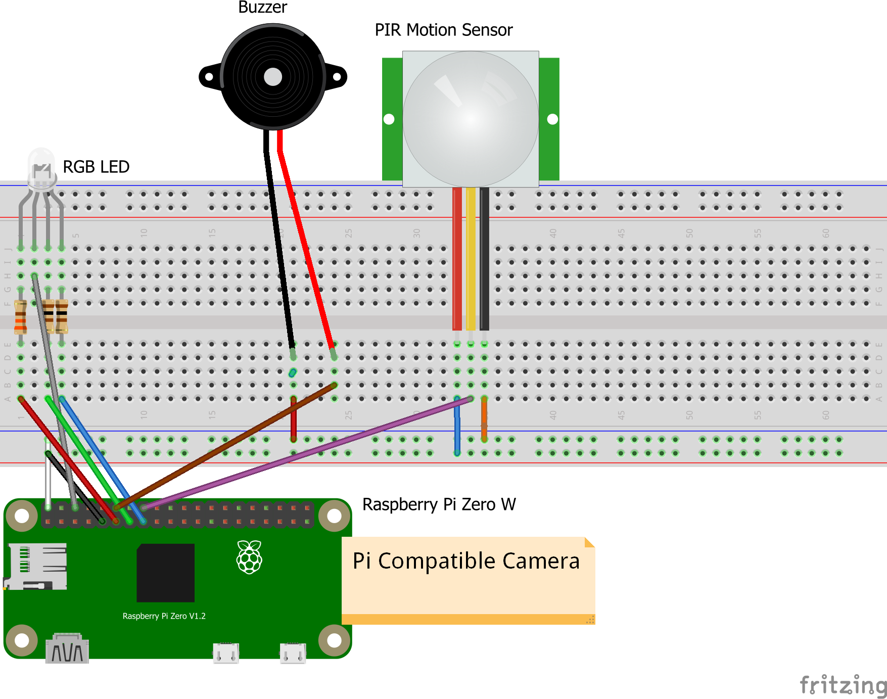

---

## Internet of Things Semester 2 Project

### Hardware

 "Circuit")

### Software

*Requirements:*
* Python 3
    * Django
        * django
        * django-bootstrap4
        * djangorestframework
        * djangorestframework_simplejwt
    * RPi.GPIO
    * picamera
    * Netifaces
    * Pushbullet.py
    * flask
* OpenCV (opencv-python)
* Nginx